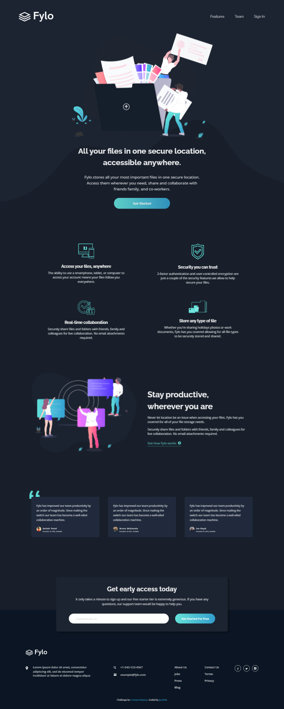

# Frontend Mentor - Fylo dark theme landing page solution

This is a solution to the [Fylo dark theme landing page challenge on Frontend Mentor](https://www.frontendmentor.io/challenges/fylo-dark-theme-landing-page-5ca5f2d21e82137ec91a50fd). Frontend Mentor challenges help you improve your coding skills by building realistic projects. 

## Table of contents

- [Overview](#overview)
  - [The challenge](#the-challenge)
  - [Screenshot](#screenshot)
  - [Links](#links)
- [My process](#my-process)
  - [Built with](#built-with)
  - [What I learned](#what-i-learned)
  - [Continued development](#continued-development)
- [Author](#author)

## Overview

### The challenge

Users should be able to:

- View the optimal layout for the site depending on their device's screen size
- See hover states for all interactive elements on the page

### Screenshot

### Links

- Solution URL: [https://github.com/jpzs444/fylo-dark-theme-landing-page](https://github.com/jpzs444/fylo-dark-theme-landing-page)
- Live Site URL: [https://jpzs444.github.io/fylo-dark-theme-landing-page](https://jpzs444.github.io/fylo-dark-theme-landing-page)

## My process

### Built with

- Semantic HTML5 markup
- CSS custom properties
- CSS Grid
- Mobile-first workflow
- Block Element Modifier (BEM) naming convention

### What I learned

I realized that it is hard to write all the CSS of a landing page without using Sass/SCSS.

### Continued development

I will focus on utilizing Sass/SCSS to make my code, as well as my files, organized.

## Author

- Frontend Mentor - [@jpzs444](https://www.frontendmentor.io/profile/jpzs444)
